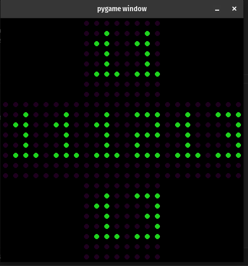

**Démarrer l'interface graphique :**

```bash
./sim.py
```

**Dans un autre terminal, compiler et lancer le programme :**

```bash
make
./challenge
```

---

## Important

* Les deux programmes doivent être lancés **en parallèle**.
* Si **rien ne s'affiche dans l'UI**, cela signifie que : **le format des données envoyées est incorrect**

---

## Aperçu



---
